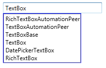
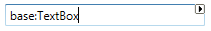
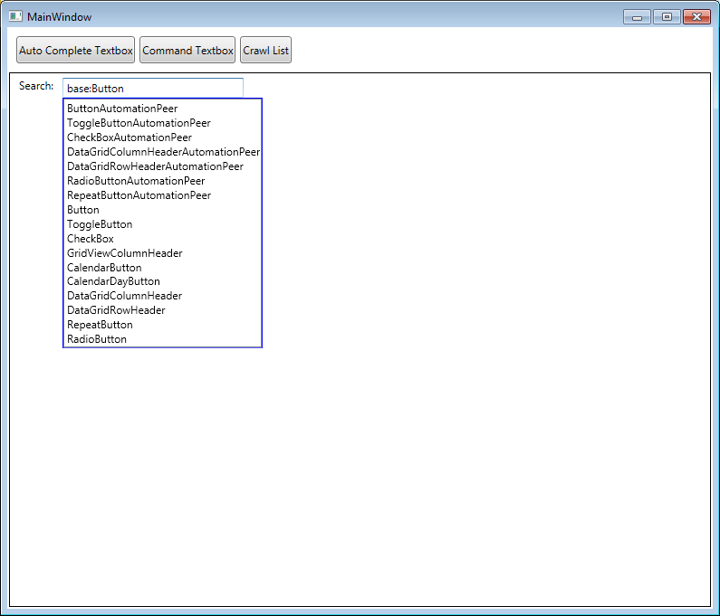
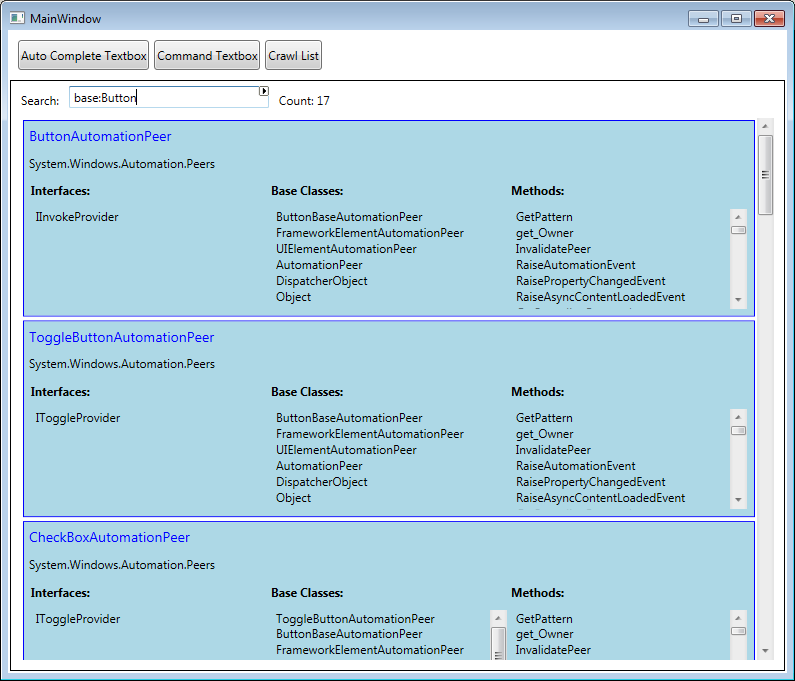
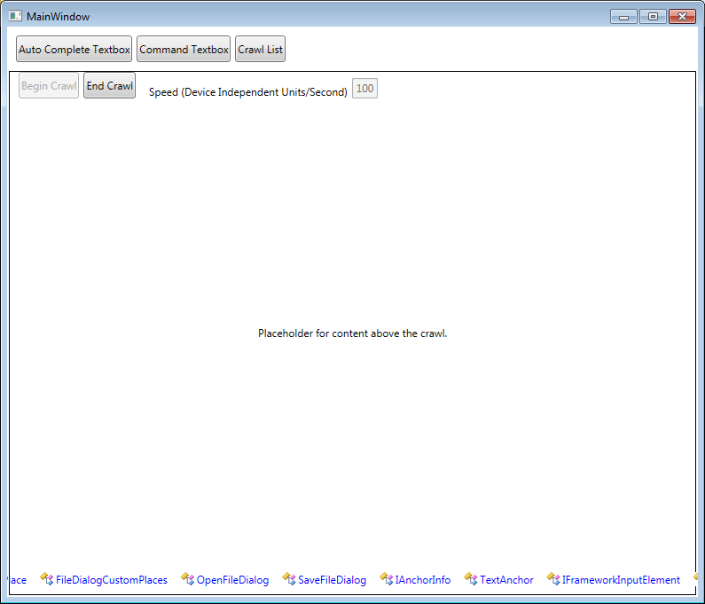

Buschmann.Windows
=================

This project contains three custom WPF controls: a crawl, auto-complete textbox and command textbox, along with a demo application and unit tests.

## Auto-complete Textbox

Binds to a list of match possiblities and filters the list as the user types.

## Command Textbox

Matches the entered text to a list of prefixes to select a command and execute it when the user hits the enter key. For example, _search:blackhawks_ could be used to execute a search for the text _blackhawks_.

## Crawl

Animates a list of items across the screen. The display of each item can be changed with a custom DataTemplate.

## Demo Application

The demo application uses reflection to get a list of .NET types and uses those as the underlying data to show the capabilities of each control.

### Auto-complete Textbox Demo

### Command Textbox Demo

### Crawl Demo

